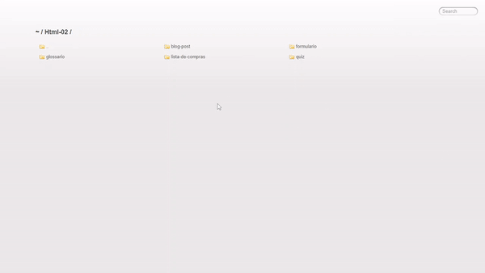

# Desafio Discover Rocketseat

<h1 align="center">
    
</h1>

<br>

### 💻 Projeto de Conceitos do HTML5 Desafio 02
Foi possível aplicar conhecimento do curso Discover da Rocketseat de forma prática nesse projeto, com os modulos:
- O guia estelar de HTML
- Posso ver e ouvir o HTML
- HTML Semantico
  
-[Discover - Rocketseat](https://app.rocketseat.com.br/discover)


### Código do Projeto

<h2 align="center">
    
</h2>

## 🧪 Tecnologias

Aplicação desenvolvida usando as seguintes tecnologias:

- [HTML5](https://www.w3schools.com/html/default.asp)

## 🚀 Iniciar Projeto
Live server com VScode ou apenas clonar pasta e acessar o index.html

###  Programas necessários para iniciar projeto
- [Live Server (Opcional)](https://marketplace.visualstudio.com/items?itemName=ritwickdey.LiveServer)
- [Visual Studio Code - Vscode](https://code.visualstudio.com/)

Clone o projeto e acesso a pasta.

```bash
$ git clone https://github.com/felipe-gomes-vicente/Discover-desafios.git
$ cd Discover-desafios/Html-02
```

## 📝 Licença

Esse projeto está sob a licença MIT. Veja o arquivo [LICENSE](LICENSE.md) para mais detalhes.


---

<p align="center">Feito com 💜 by Felipe Vicente👋</p>  

- ## My LinkedIn - [](https://www.linkedin.com/in/felipe-gomes-vicente/) 
