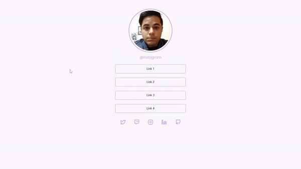

# Desafio Discover Rocketseat

<h1 align="center">
    
</h1>

<br>

### 💻 Projeto Social Tree Desafio 06
O desafio é uma página social tree uma página para gerenciar links e redes sociais, serviço destinado para centralizar suas redes sociais e links assim mais facil compartilhar artigos, fotos, videos gerenciar todo o seu conteúdo. Construído com 
as tecnologias HTML e CSS.

O que foi feito:
- Manipular página com arquivo CSS externo 
- Interagir com os botões de rede social e de link
- Imagem de perfil aplicado borda redonda e moderna
- Cursor do mouse como ponteiro no botão
- Importação de fonte(tipografia) externa no arquivo CSS
- Utilizar variaveis CSS para manipular a paleta de cores do projeto
- Reset CSS removendo possíveis inconsistências entre navegadores diferentes
- Sistema de arquivos do projeto separado por pasta
 
Aplicado meu conhecimento do Discover da Rocketseat conceitos de forma prática nesse projeto, com os modulos:
- O guia estelar de HTML
- O guia estelar de CSS
- Pilotando com a DOM
- Alinhando os planetas

-[Discover - Rocketseat](https://app.rocketseat.com.br/discover)

 

## 🧪 Tecnologias

Aplicação desenvolvida usando as seguintes tecnologias:

- [HTML5](https://www.w3schools.com/html/default.asp)
- [CSS3](https://www.w3schools.com/css/default.asp)
  

## 🚀 Iniciar Projeto
Live server com VScode ou apenas clonar pasta e acessar o index.html

###  Programas necessários para iniciar projeto
- [Live Server (Opcional)](https://marketplace.visualstudio.com/items?itemName=ritwickdey.LiveServer)
- [Visual Studio Code - Vscode](https://code.visualstudio.com/)

Clone o projeto e acesso a pasta.

```bash
$ git clone https://github.com/felipe-gomes-vicente/Discover-desafios.git
$ cd Discover-desafios/social-tree-06
```

## 📝 Licença

Esse projeto está sob a licença MIT. Veja o arquivo [LICENSE](LICENSE.md) para mais detalhes.


---

<p align="center">Feito com 💜 by Felipe Vicente👋</p>  

- ## My LinkedIn - [](https://www.linkedin.com/in/felipe-gomes-vicente/) 
